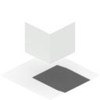
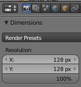
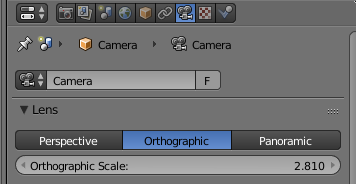
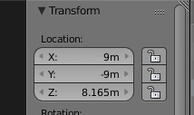

Blender script to render isometric sprites from different angles.

	$ ./render-isometric-sprite.sh 
	Usage: render-isometric-sprite.sh myfile.blend [--scale 100] [--dest /path/to/dir]

 * Start with [isometric.blend](./isometric.blend) as a template.
 * Use [this tutorial](http://flarerpg.org/tutorials/isometric_tiles/) to acheive different tile sizes.
 * Set the following properties to change aspect ratio, resolution, position, etc.

**Render resolution** changes absolute size (and aspect ratio) of the output sprites.

**Camera orthographic scale** should be some multiple of `2.81` to cover different amounts of area (zoom).

**Camera location settings** move the viewport around.

